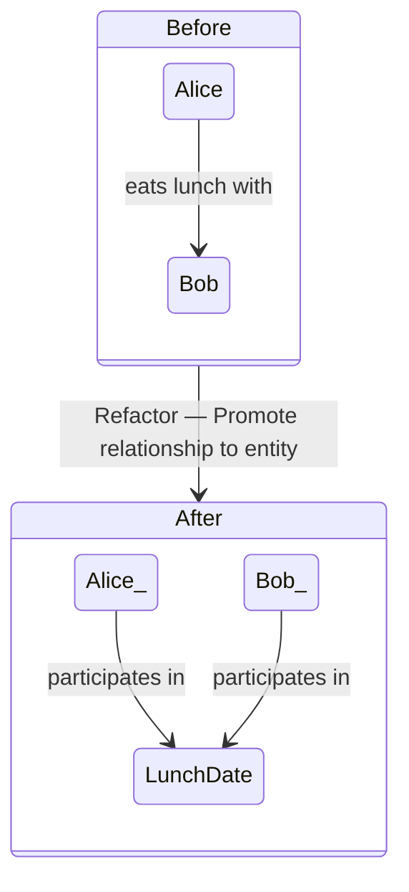
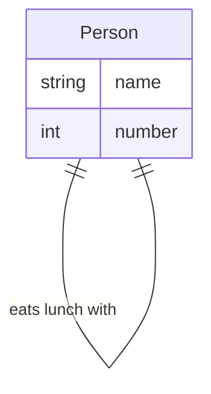
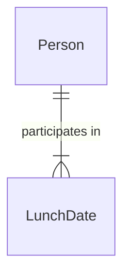
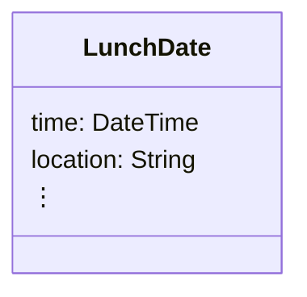
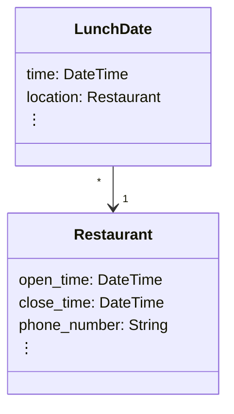
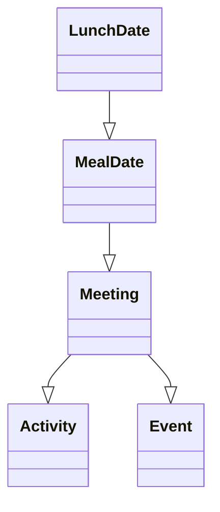
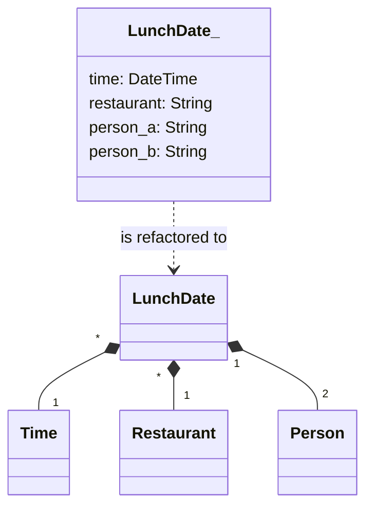

# Some Thoughts on Database Design

The design of a database schema is in practice a conversation between the developer, the dataset(s), and the problem the
db solves. (The client is often a partial proxy for the problem.) Database schemas are not created at once out of whole
cloth and then never changed. They are grown, modified, and evolved to better fit the needs of the application. A schema
can be changed in a variety of ways throughout application development. Many kinds of modifications are trivial, easy to
implement, or otherwise uninteresting. In this article, I discuss two specific kinds of schema refactoring tasks
that are common during the development process but that are in general disruptive to the codebase. The point is to
think about what is required to carry out these tasks and how the tasks might be made easier. I then discuss another
kind of refactoring of schema that occurs in parallel to the first two, namely handling the common case of the failure
of the insertion of a dataset into the database.

## Two Database Refactoring Tasks

### Task 1: Relationship Promotion

Consider the contrived example of two people having lunch together. Suppose we discover that a relationship we have between entities needs to have its own properties. We need to promote the relationship to
a first-class entity. The diagram below depicts what an *instance* of the entities would look like before and after the
refactor. (Other constraints are not considered here.)

 The entity relationship diagram before the refactor:

The entity relationship diagram after the refactor:

### Task 2: Property Promotion

Consider the `LunchDate` entity from the previous example. It might have properties like the time the people agreed to
meet, the restaurant they plan to eat at, and so forth.

Suppose we discover that we want to keep track of information
about different restaurants that people can eat lunch at. The `location` property of `LunchDate` needs to be promoted to
a first-class entity.

## Model Granularity

In both refactoring tasks above, the *granularity* of the data model has become finer. The granularity of a model is the
extent to which abstraction is present in the model. In a finer (more *refined*) granularity:

* Hierarchies are expanded. Call this *vertical expansion*. E.g., a `LunchDate` is a `MealDate`, which is a `Meeting`, which is both an `Event` and an `Activity`,
  ....

* Properties are promoted to entities. Call this *horizontal expansion*.

In the limit, every relationship is an *is-a* relationship.

Not having enough granularity in the model results in 
